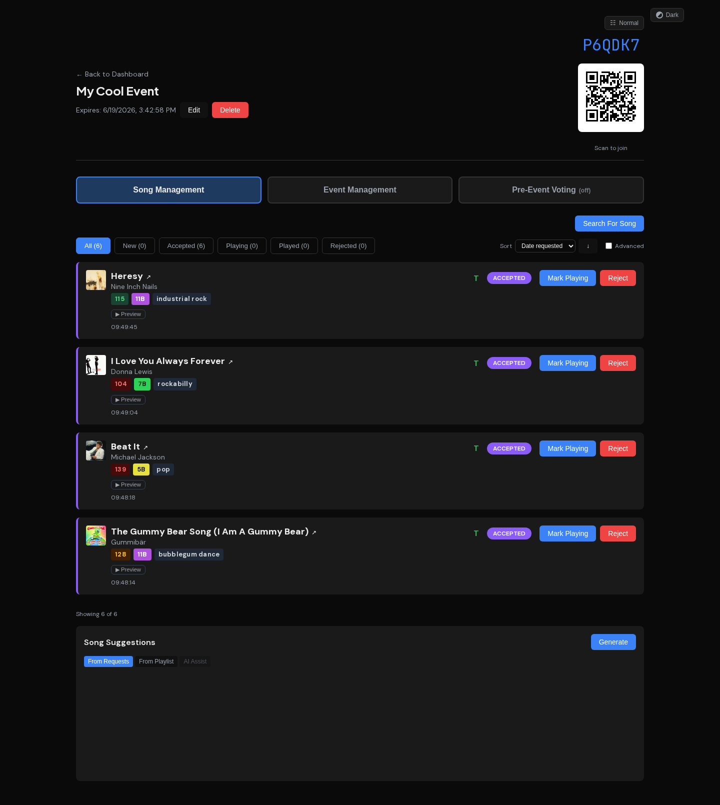
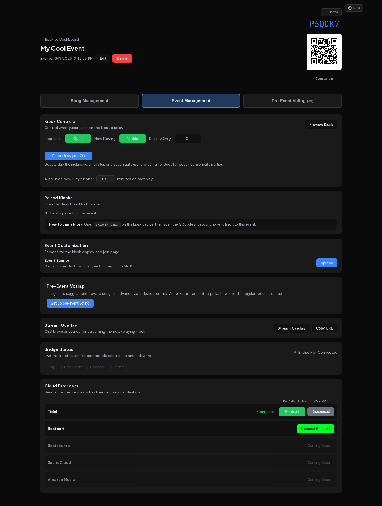
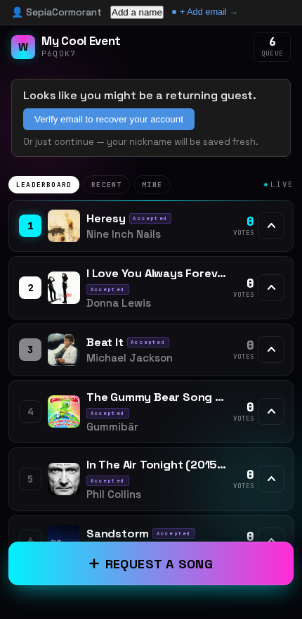
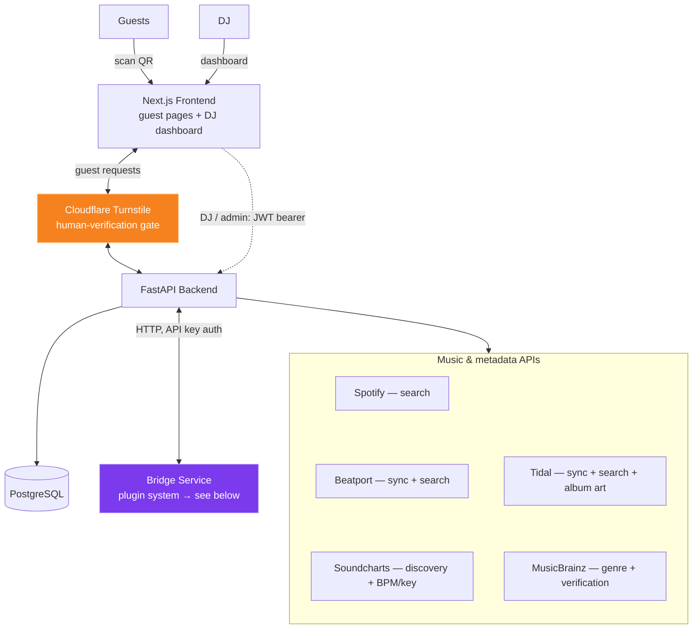
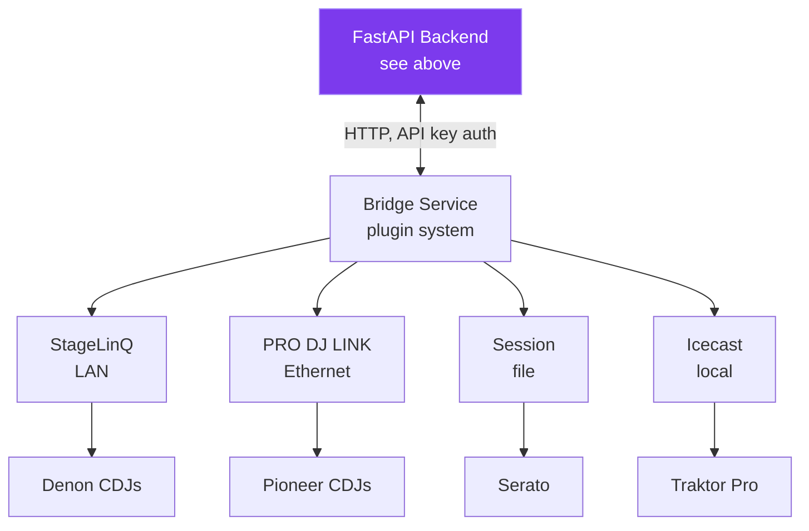

<p align="center">
  
  
  
  
</p>

# WrzDJ

A real-time song request system for DJs. Guests scan a QR code to submit requests. DJs manage everything from a live dashboard with automatic track detection from their equipment via plugins for Denon, Pioneer, Serato, and Traktor.

<p align="center">
  
  <br>
  <em>Song Management: request queue with BPM/key/genre metadata, accept/reject, song suggestions</em>
</p>

<p align="center">
  
  <br>
  <em>Event Management: kiosk controls, bridge status with admin commands, cloud provider sync</em>
</p>

<p align="center">
  
  <br>
  <em>Guest join page: scan a QR code, browse the queue, request a song</em>
</p>

---

## Features

**Guest experience**
- QR code join, no app install or login required
- Search songs via Tidal, submit requests with notes, upvote others
- Live request queue and kiosk display showing what's playing now
- Cloudflare Turnstile human verification (invisible managed challenge) on `/join` and `/collect`
- Nickname gate (profanity filter + letter-padding bypass protection) on standard events, or **frictionless join** — when the DJ enables it, guests skip the nickname/email step and get an auto-generated name they can rename later (great for weddings and private parties)
- Email verification with one-time codes (Resend API) and cross-device guest profile merge
- Pre-event song collection (`/collect`) — guests vote on suggestions before the night, DJs bulk-review
- Inline song preview in the collect detail sheet (Tidal embed)
- Verified badge next to email-verified nicknames in request lists and leaderboard
- Tower v2 UI on `/join` and `/collect` with banner art, song detail panels, and vibes enrichment

**DJ dashboard**
- Accept, reject, and manage requests in real-time (SSE push updates)
- Tabbed event detail with Song Management and Event Management views
- Search Beatport, and Tidal directly from the dashboard
- Inline audio previews for Tidal tracks
- Color-coded Camelot key badges and BPM proximity indicators for harmonic mixing
- Single-active playing constraint (marking a new track auto-transitions the previous one)
- Multi-service playlist sync to Tidal and Beatport with version-aware matching
- Manual track linking when auto-match fails
- Event banners, play history with source badges, CSV export
- "Enrich All" advanced action to backfill BPM/key/genre on existing requests in batches
- Pre-event collection toggle per event (enable guest voting before doors open)
- Frictionless-join toggle per event (skip the guest nickname/email gate, auto-name guests), with a per-DJ account default applied to new events
- Collection suggestions sync to a dedicated pre-event Tidal playlist; bidirectional option auto-rejects requests removed from the playlist
- Self-service account management: DJs can update their own password and email address
- Bridge connection status, activity log, contextual help system
- Cloud provider OAuth (Tidal, Beatport) with per-event playlist sync toggles

**Song recommendations**
- Three modes: From Requests (musical profile), From Playlist (template), AI Assist (natural language via Claude)
- Scored on BPM compatibility, harmonic key, genre similarity, and artist diversity
- Half-time BPM matching, junk filtering, MusicBrainz artist verification badges
- Background metadata enrichment via ISRC matching, Beatport, Tidal, MusicBrainz, Soundcharts

**Admin dashboard**
- User management with role-based access (admin/dj/pending) and self-registration
- Integration health dashboard with per-service enable/disable toggles
- AI/LLM settings, search rate limits, system settings (all DB-backed, no restart needed)
- Human verification enforcement toggle (soft mode for rollout, hard mode post-rollout)

**Security & identity**
- Fernet-encrypted OAuth tokens at rest (MultiFernet for key rotation)
- Supply-chain hardening: all GitHub Actions pinned to commit SHAs, committed lockfiles (`uv.lock` at CVE-floor versions, `package-lock.json`), CI security scans (bandit, pip-audit, npm audit), and a SHA-digest-pinned base image in the bridge build
- Separate public codes for pre-event collection (`/collect`) and live join (`/join`); guest-facing endpoints never expose internal event IDs
- IP-free guest identity (cookie + ThumbmarkJS reconciliation, no IP storage or logging)
- HMAC-signed `wrzdj_human` cookie with 60-min sliding window after Turnstile pass
- IP-bound nonce flow for kiosk-pair (no Turnstile on input-less Pi devices)

**Kiosk display**
- Full-screen three-column layout: Now Playing, Up Next, Recently Played
- QR pairing with session persistence across power cycles
- Custom banner backgrounds, built-in request modal with touchscreen keyboard, display-only mode
- Raspberry Pi deployment with WiFi captive portal and crash recovery watchdog

**Stream overlay**
- Transparent OBS browser source at `/e/{code}/overlay`
- Now Playing track with album art, queue with vote counts

**Bridge (DJ equipment detection)**
- Plugin system: Denon StageLinQ, Pioneer PRO DJ LINK, Serato DJ, Traktor Broadcast
- Automatic request matching via fuzzy search, Tidal album art enrichment
- Circuit breaker, reconnection with backoff, track buffer replay
- Upstream dependency contract testing with weekly drift detection CI
- Desktop app (Windows/macOS/Linux) or CLI

---

## WrzDJSet (Beta)

**WrzDJSet** is an AI-assisted set planner built into the DJ dashboard. Instead of hand-building a
setlist track by track, you gather candidate songs into a pool, let WrzDJ draft an energy-aware
running order, then refine it conversationally with an AI agent before exporting to your DJ software.

It is currently in **Beta**: the full plan-a-set loop (import → build → refine → export) is shipped
and usable, while deeper integrations (local-library readers, more export targets, collaboration) are
still on the roadmap.

### How it works

1. **Build a pool.** Pull candidate tracks from several sources — a live event's requests, your Tidal
   or Beatport playlists, a public playlist URL, or manual search. Tracks are de-duplicated on import
   (by ISRC, with an artist + title fuzzy fallback) and tagged by source, so you can drop a whole
   source at once.
2. **Draft the order (Pass 1).** A deterministic pass generates time-based slots for your target set
   length and greedily orders the pool, scoring each transition on energy, BPM, Camelot-key
   compatibility, transitional role, mood, and artist diversity — then runs a 2-opt refinement that
   respects any slots you've locked and any track pairings you've saved.
3. **Shape the energy curve.** Apply a built-in or saved energy-curve template (with slow-window
   markers for breaks); every slot gets a target energy the builder mixes toward.
4. **Refine with the AI agent (Pass 2).** The set is auto-critiqued — graded, with flags such as
   energy dips, vibe clashes, era jumps, or a banger buried too early — and you can chat with an agent
   to reshape it ("make the first 20 minutes warmer", "lock slot 5", "swap these two"). The agent
   works through a fixed, auditable toolkit of reorder / swap / lock / insert / curve actions, each
   requiring a rationale, with full undo/redo and autosave.
5. **Export.** Send the finished set to Rekordbox XML, Engine DJ, Lexicon, M3U, or plaintext — or push
   it straight to a Tidal playlist. A preflight check flags any unresolved tracks first.

### Track vibes & community consensus

Tracks carry "vibe" metadata — energy (0–10), mood, era, sing-along and dance-floor signals, and a
transitional role — which drives the transition scoring. Vibes resolve in three tiers: your own
overrides first, then community consensus (aggregated from other DJs' tweaks once there is enough
agreement), then an AI-generated baseline. You can upvote or adjust any vibe, which feeds the shared
consensus.

### AI & privacy

All AI calls route through WrzDJ's **LLM Gateway** connector system — there is no hard-coded model
provider in the set builder. Each DJ's calls use their configured connector (or an org default), and
usage is logged for auditing. See `ARCHITECTURE.md` and `docs/LLM-PLUGIN.md` for the gateway contract.

### Sharing

Any set can be shared as a read-only link (a revocable capability token) and duplicated as a starting
point for the next night.

### Beta limitations (on the roadmap)

- Reading from **local DJ libraries** (Rekordbox / Serato / Engine DJ on disk) and streaming local
  files through the Bridge
- Writing to **Serato crates / Engine DJ databases** and to **Spotify / Apple Music** playlists
- Reusable **set templates**, real-time **collaboration** (invite co-editors), and **taste-profile**
  training from your vibe history
- Structural "autobuild" agent tools (e.g. fill-to-duration, move-range)
- No hard caps on AI usage yet — per-DJ usage is audited, but cost guardrails are not surfaced to you

WrzDJSet lives under `server/app/services/setbuilder/` (backend) and `dashboard/app/(dj)/setbuilder/`
(frontend).

---

## Architecture

**App & data plane** — guests and the DJ share one Next.js frontend. Guest actions pass through the
Cloudflare **Turnstile** human-verification gate; DJs/admins authenticate with a JWT instead. The
backend fans out to music/metadata services, and the highlighted **Bridge Service** is the seam into
the equipment plane shown below.



**Equipment plane** — the Bridge Service runs the DJ-equipment plugins. The highlighted **FastAPI
Backend** is the same seam from the diagram above (it pushes now-playing data over HTTP).



| Service | Stack | Directory |
|---------|-------|-----------|
| Backend | Python, FastAPI, SQLAlchemy 2.0, PostgreSQL, Alembic | `server/` |
| Frontend | Next.js 16, React 19, TypeScript, vanilla CSS | `dashboard/` |
| Bridge | Node.js, TypeScript, plugin architecture | `bridge/` |
| Bridge App | Electron, React, Vite, electron-forge | `bridge-app/` |
| Kiosk | Raspberry Pi, Cage (Wayland), Chromium, Python stdlib | `kiosk/` |

### Supported DJ Equipment

**Denon (via StageLinQ)** -- SC6000, SC5000, Prime 4/4+, Prime 2, Prime Go, X1850/X1800 mixer

**Pioneer (via PRO DJ LINK)** -- CDJ-3000, CDJ-2000NXS2/NXS, XDJ-1000MK2, XDJ-700, DJM-900NXS2/750MK2 mixer. Requires Ethernet (same LAN).

**Serato (via session file monitoring)** -- Serato DJ Pro/Lite, any controller. Reads session files from disk, no network setup needed.

**Traktor (via Broadcast)** -- Traktor Pro 3/4, any controller with broadcast enabled.

---

## Quick Start (Local Development)

### Prerequisites

- Docker + Docker Compose
- Python 3.11+
- Node.js 22+
- [Tidal Developer Account](https://developer.tidal.com/) (for song search and album art enrichment)

### 1. Clone and configure

```bash
git clone https://github.com/thewrz/WrzDJ.git
cd WrzDJ
cp .env.example .env
# Edit .env with your Spotify/Tidal API keys, JWT secret, etc.
```

### 2. Start the database

```bash
docker compose up -d db
```

### 3. Install git hooks

```bash
./scripts/setup-hooks.sh
```

### 4. Start the backend

```bash
cd server
python -m venv .venv
source .venv/bin/activate
pip install -e ".[dev]"
alembic upgrade head
python -m app.scripts.create_user --username admin --password admin
uvicorn app.main:app --reload --host 0.0.0.0 --port 8000
```

### 5. Start the dashboard

```bash
cd dashboard
npm install
npm run dev
```

### 6. Access the apps

- **API**: http://localhost:8000
- **API Docs**: http://localhost:8000/docs
- **Dashboard**: http://localhost:3000

### 7. (Optional) Run the bridge

The bridge connects to DJ equipment and reports "Now Playing" data to the server. It requires a running WrzDJ server (steps 1-6 above).

**Desktop app (recommended):** Download from [Releases](https://github.com/thewrz/WrzDJ/releases) (Windows `.exe`, macOS `.dmg`, Linux `.AppImage`). Also available via `winget install WrzDJ.WrzDJ-Bridge` on Windows.

**CLI bridge:**

```bash
cd bridge
npm install
cp .env.example .env
# Edit .env with your API URL, bridge API key, event code, and protocol
npm start
```

---

## Deployment

Production uses a subdomain model: `app.your-domain.example` (frontend) and `api.your-domain.example` (backend).

### Docker Compose (Local Full Stack)

```bash
docker compose up --build
```

### Deploy from Pre-Built Images (GHCR)

Self-hosters can run pre-built multi-arch images from GitHub Container Registry instead of building from source:

- `ghcr.io/wrzonance/wrzdj-api` — FastAPI backend
- `ghcr.io/wrzonance/wrzdj-web` — Next.js frontend (the API URL is patched in at container start, so one image works for any domain)

Tags: `latest` (main), `vX.Y.Z` / `X.Y` (release tags), `sha-<short>` (every commit).

```bash
cd /opt && git clone https://github.com/thewrz/WrzDJ.git && cd WrzDJ
cp deploy/.env.example deploy/.env   # set WRZDJ_VERSION (default: latest) and secrets
./deploy/deploy-ghcr.sh              # pulls images, restarts the stack, polls /health
```

`deploy/docker-compose.ghcr.yml` runs db + api + web straight from the registry (no `--build`); `deploy/deploy-ghcr.sh [VERSION]` is the one-command pull-and-restart helper.

### PaaS (Render / Railway)

**Render** auto-detects `render.yaml`. Push to GitHub, connect to [Render](https://render.com), set credentials in the Environment tab.

**Railway**: Create project on [Railway](https://railway.app), add PostgreSQL, deploy `server/` and `dashboard/` as separate services.

### VPS (Docker + nginx)

```bash
cd /opt && git clone https://github.com/thewrz/WrzDJ.git && cd WrzDJ
cp deploy/.env.example deploy/.env  # Fill in secure values
docker compose -f deploy/docker-compose.yml up -d --build
```

Set up nginx:
```bash
APP_DOMAIN=app.yourdomain.com API_DOMAIN=api.yourdomain.com ./deploy/setup-nginx.sh
sudo certbot --nginx -d app.yourdomain.com -d api.yourdomain.com
```

GoAccess analytics are available for production traffic — see `deploy/scripts/analytics.sh`.

See `deploy/DEPLOYMENT.md` for full setup instructions.

### Required Backend Environment Variables

```
ENV=production
DATABASE_URL=<PostgreSQL connection string>
JWT_SECRET=<openssl rand -hex 32>
TOKEN_ENCRYPTION_KEY=<Fernet key: python -c "from cryptography.fernet import Fernet; print(Fernet.generate_key().decode())">
SPOTIFY_CLIENT_ID / SPOTIFY_CLIENT_SECRET
TIDAL_CLIENT_ID / TIDAL_CLIENT_SECRET
BEATPORT_CLIENT_ID / BEATPORT_CLIENT_SECRET
BRIDGE_API_KEY=<openssl rand -hex 32>
TURNSTILE_SITE_KEY / TURNSTILE_SECRET_KEY  # Cloudflare Turnstile (human verification + DJ self-reg)
HUMAN_COOKIE_SECRET=<openssl rand -base64 32>  # signs wrzdj_human cookie
RESEND_API_KEY  # email verification provider
EMAIL_FROM_ADDRESS=noreply@send.yourdomain.com
SOUNDCHARTS_APP_ID / SOUNDCHARTS_API_KEY  # discovery API
LISTENBRAINZ_USER_TOKEN  # optional, ListenBrainz artist discovery for recommendations
CORS_ORIGINS=https://app.yourdomain.com
PUBLIC_URL=https://app.yourdomain.com
```

---

## API Documentation

Interactive API docs are available at `/docs` when the backend is running.

---

## Project Structure

```
WrzDJ/
  server/           # FastAPI backend
  dashboard/        # Next.js frontend
  bridge/           # DJ equipment bridge (Node.js)
  bridge-app/       # Electron desktop app for the bridge
  kiosk/            # Raspberry Pi kiosk deployment
  deploy/           # Production deployment configs
  scripts/          # Git hooks and dev tooling
  .github/workflows # CI, release, and dependency health pipelines
```

---

## License

MIT
